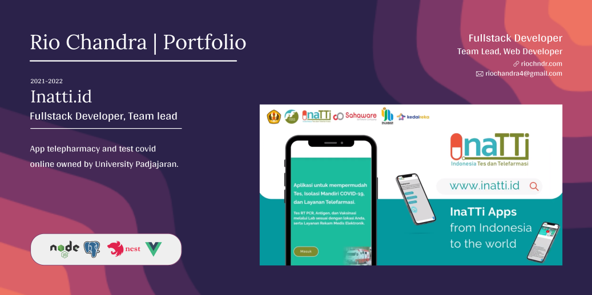
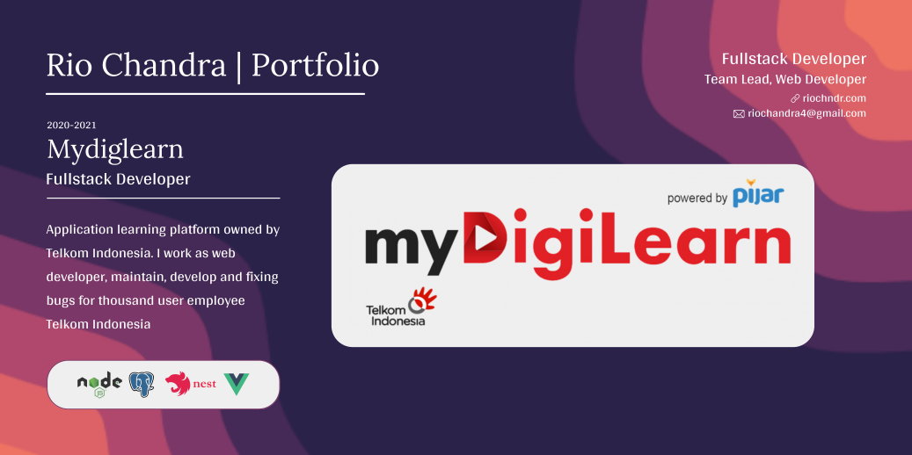
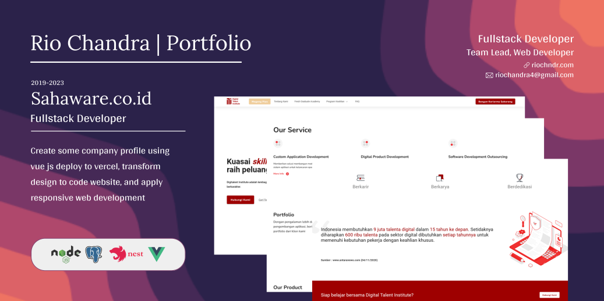
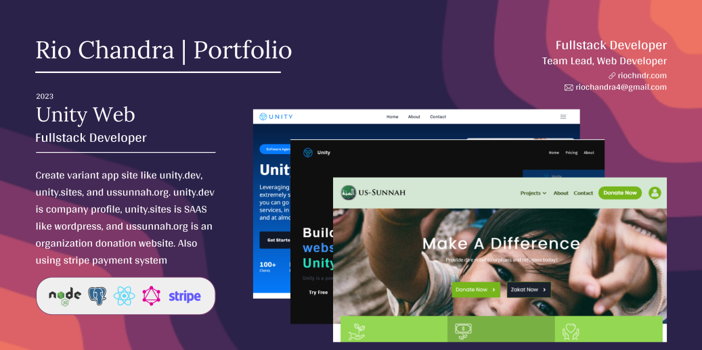
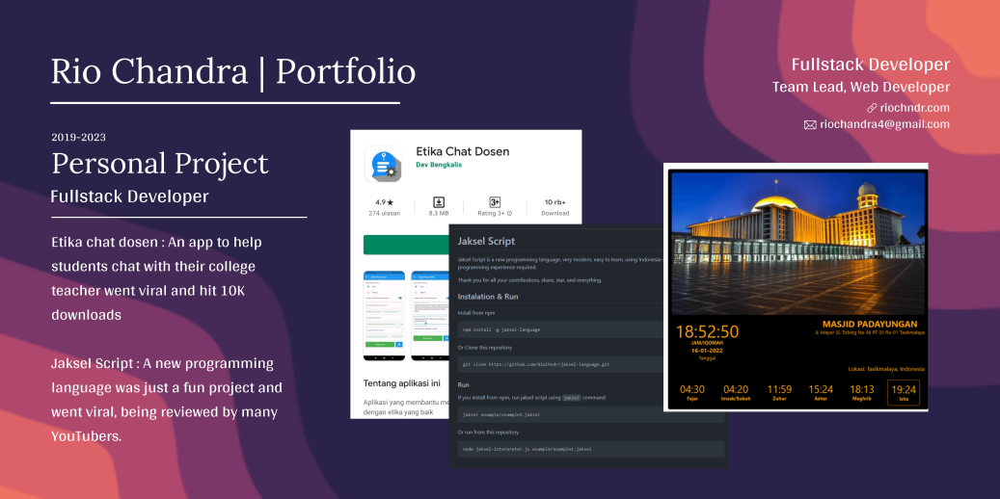

## Tech Stack

I have experience in the following technologies:

- **Programming Languages**: Javascript, Nodejs, Typescript
- **Frontend**: React, Redux, Nextjs, Gatsby, Tailwindcss, Bootstrap, Material UI, Styled Components, HTML, CSS
- **Backend**: Express, Nestjs, MongoDB, PostgreSQL, MySQL, Redis, GraphQL, Apollo Server, Prisma

## Portfolio Projects

I have create some projects for my portfolio, you can check it out below:

