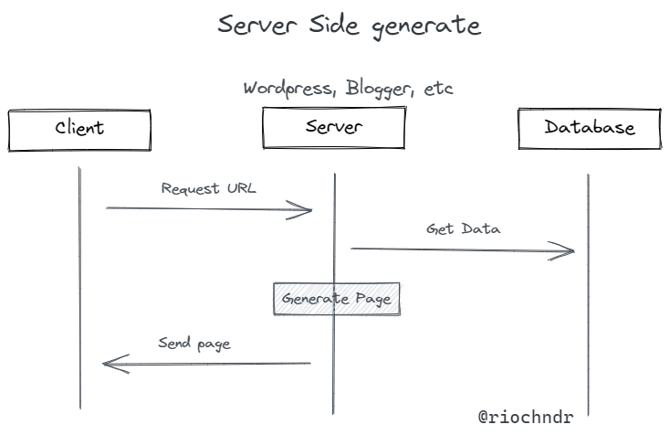
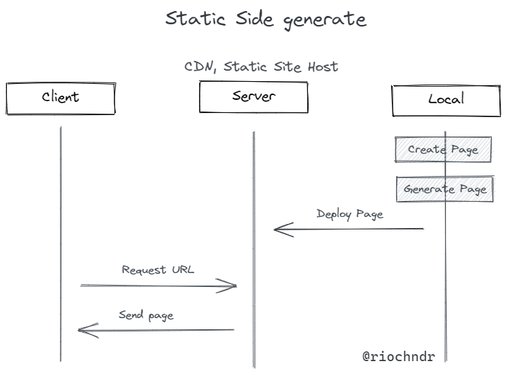
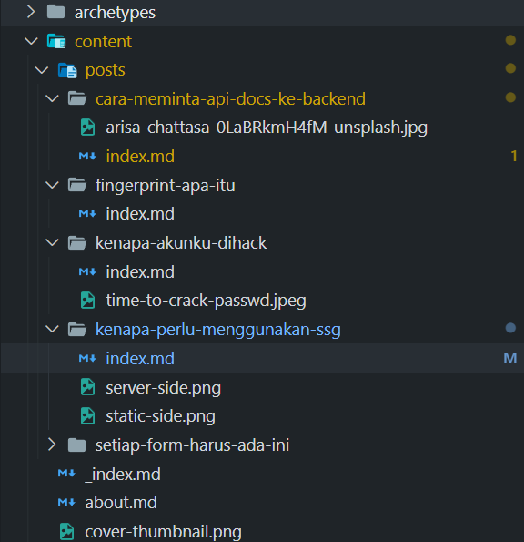

Salah satu contoh tempat menulis seperti blog adalah medium. [Medium](https://medium.com) adalah salah satu tempat menulis yang sangat menarik, gratis, bisa diakses dimana-mana dan bisa mendapatkan uang jika serius di tekuni. Beberapa tulisan saya tulis di [medium Rio Chandra](https://riochandra.medium.com/) dapat beberapa feedback yang sangat bagus dan berjalan dengan baik. Tapi kali ini saya coba menggunakan *Web static generator* dengan tools [gohugo](https://gohugo.io). Baik medium atau gohugo, keutamaan dari ini adalah menulis dan berbagi hal ke orang lain. Tools apapun yang digunakan, berbagi ilmu ke orang lain bukan hal yang merugikan.

## Apa itu SSG (Static Site Generator)

Zaman teknologi saat ini, perkembangan informasi mudah disebar kemana-mana, pertama website dikenalkan sudah mulai berkembang yang namanya blog. Mulai menjamur aplikasi-aplikasi website untuk membuat blog, seperti Blogger, Wordpress, Jombla. Teknologi ini mulai digemari banyak orang karena kemudahan dalam membuat blog dan fitur yang cukup mumpuni untuk sebuah blog seperti membuat postingan, komentar, view, like, dan share.

Tenkologi blog saat itu memerlukan tampilan website yang cantik, sistem authentikasi admin yang aman, database yang lengkap, fitur yang bagus. Semakin lama, semakin banyak permintaan custom yang mengakibatkan banyak aplikasi yang perlu memberikan fitur 'plugin' untuk memberikan kebebasan kepada user melakukan perubahan pada blognya. Tapi membuat plugin dan tampilan sendiri butuh kemampuan teknis seperti menulis kode.

Kebutuhan berbagi informasi ini semakin ramai digunakan dan mulai berkembang luas. Kebutuhan server membengkak seiring blog semakin ramai diisi. Aplikasi blog hanya paling sering dilihat bagian depan website dan konten blog, sedangkan bagian dalam halaman administrator dan hanya admin sendiri yang sering digunakan. Tetapi resource kode blog sebagian besar diisi untuk memenuhi kebutuhan administrator. Sedangkan halaman yang sering dikunjungi adalah halaman depan blog. Komputasi server juga menjadi berat seiring blog yang berkembang. Untuk memulai membuat blog memerlukan minimal server dengan RAM 512 MB, HDD 1 GB, web server, database, CPU minimal 1 GHz. Membutuhkan biaya yang tidak sedikit untuk memulai membuat blog.

Server Site Generator (SSG) datang untuk memecahkan masalah dengan solusi yang baru. Dari pada membuat server untuk menyimpan sistem hosting blog termasuk administrasinya, karena blog hanya halaman HTML dan CSS yang berisi konten maka kita hanya perlu menyiapkan konten HTML untuk membuat blog. Dengan SSG kita hanya perlu menyiapkan konten (biasanya dalam bentuk teks [Markdown](https://www.markdownguide.org/)) lalu generate yang akan menghasilkan konten HTML, CSS dan JS saja. Dengan begitu tidak memerlukan server yang besar untuk memulai sebuah blog dan bisa di akses dengan cepat karena server tidak perlu mengolah apa-apa selain mengirimkan halaman ke *hosting static site*.

Proses pengiriman konten ke user menjadi lebih cepat karena server tidak perlu mengolah apa-apa selain mengirimkan konten ke user. User menjadi lebih nyaman, fokus kepada konten dan apapun yang dilakukan user kepada website menjadi lebih cepat.

## Kenapa memilih Static Site Generator

### Mencoba

Sebagai developer dan teknologi antusias, tools baru yang muncul setiap saat rasanya tidak sah jika belum dicoba dan menelaah apa yang bisa dilakukan dari teknologi ini. *Gohugo* dapat membuat website dalam hitungan menit, gratis dan mudah digunakan. *Static Site Generator SSG* yang mulai hype akhir-akhir ini menjadi alasan mencoba blog dengan gohugo. Setelah mencoba gohugo cukup menarik karena banyak fitur yang ditawarkan.

### Gratis

Biaya yang dikeluarkan hanya 0 Rupiah. Tidak menyewa server, tidak membeli domain, tidak menyiapkan database. Hosting file cukup menggunakan [github pages](https://pages.github.com/).
*NB : Kecuali saya ingin membeli domain*

### Customable

Tampilan custom yang bisa di download dimana saja, di internet sudah cukup banyak *template theme* gohugo yang siap pakai. Tinggal dipasang dan tampilan website sudah sangat menarik. Selain itu, kita bisa membuat template sendiri, pastinya ini memerlukan kemampuan teknis untuk mengaturnya.
Selain itu, gohugo yang bentuknya static site generator, juga bisa embed fitur komentar seperti [Disqus](https://disqus.com/home/). Rasanya sudah seperti blog pada umumnya. Implementasi [Google analytics](https://analytics.google.com) dapat melihat kunjungan user ke website dan dapat analisa kebiasaan user di website kita sendiri.

### Memiliki lingkungan pribadi

Memiliki ruang sendiri untuk berkarya dan berekspresi menjadi sebuah perasaan yang unik untuk berkembang. Tidak hanya itu, berbagi kepada yang lain juga merupakan salah satu proses belajar agar dapat memahami apa yang dipelajari lebih lama.

### Lebih cepat mengirim konten

Karena konten hanya berupa dokumen HTML, server tidak perlu mengolah apa-apa selain mengirimkan dokumen HTML. Proses ini lebih cepat dibandingkan biasanya. Pengalaman user yang akan membaca blog akan lebih nyaman karena konten yang diinginkannya cepat diproses. [15 seconds Rule](https://www.crazyegg.com/blog/why-users-leave-a-website/) adalah aturan yang membuat user meninggalkan website setelah 15 detik. User tidak ingin menunggu lama, ia akan mencari website lain jika website tujuannya butuh waktu lama untuk *load*. SSG memotong waktu proses di server menyebabkan proses menjadi lebih cepat.

## Cara Memulai

Untuk membuat SSG anda hanya perlu memilih tools yang akan digunakan, [Jamstack site generator](https://jamstack.org/generators/) memiliki daftar tools untuk membuat *static site generator*.
Saya akan coba memilih [Hugo](https://gohugo.io/) sebagai *static site generator* yang paling populer.

1. Install hugo dari [dokumentasi hugo](https://gohugo.io/installation/)
2. Buat website baru dengan perintah `hugo new site blog-saya`
3. Pilih tema, Ikuti step-step [memasukkan tema ke hugo](https://gohugo.io/getting-started/quick-start/#step-3-add-a-theme)
4. Tambah konten dengan perintah `hugo new posts/my-first-post.md`
5. Jalankan server dengan perintah `hugo server -D`

Setelah berhasil membuat postingan, selanjutnya lakukan deployment. Pastikan simpan ke repository github/gitlab untuk penyimpanan blog. Ada banyak [opsi deployment dari hugo](https://gohugo.io/hosting-and-deployment/), seperti [github](https://gohugo.io/hosting-and-deployment/hosting-on-github/), vercel, [netlify](https://gohugo.io/hosting-and-deployment/hosting-on-github/). Semua hosting static file ini **gratis**, kamu tidak perlu menyiapkan server hosting dan database yang besar untuk memulai.

Selanjutnya untuk membuat postingan cukup tulis `hugo new posts/my-second-post.md`. Untuk menulis konten di markdown, pelajari markdown di [markdowntutorial.com](https://www.markdowntutorial.com/).

## SSG Jadi pilihan terbaik ?

Tidak !. SSG tidak menjadi *silver bullet* yang bisa di implementasi di sebuah hal. Beberapa hal yang perlu di perhatikan jika ingin menggunakan SSG adalah

**Kemampuan teknis**
SSG sangat lekat dengan kode, markdown dan hal *geek* lainnya. Jika minim dalam hal ini lebih baik sewa pekerja untuk menyiapkan SSG dengan cepat.

**Pengalaman yang berbeda**
Pengalaman membuat blog biasanya yang perlu membuka website administrator lalu membuat postingan, upload file dengan mudah dan membuat link dengan mudah. Berbeda dengan SSG, anda akan dibiasakan dengan *syntax markdown* untuk semua hal dalam membuat blog. Bagi saya pribadi, mempelajari markdown bukan hal yang merugikan, malah membuat penulisan dokumen menjadi lebih cepat dan lama-lama akan terbiasa dengannya. Tapi bagi tidak semua orang bisa beradaptasi dengan ini, maka perlu waktu belajar dan pemahaman teknis.

Saat ini banyak juga perusahaan, blog, atau company profile yang menggunakan SSG untuk mengirim konten ke user dengan cepat sehingga revenue dari perusahaan meningkat karena user nyaman dengan websitenya.

Tapi tidak semua kasus bisa diimplemnetasi pada SSG mengingat SSG tidak memiliki proses internal didalamnya, maka fitur seperti postingan yang khusus untuk user, akses user login, atau interaksi lebih detail pada blog mungkin cukup sulit untuk di implemnetasi menggunakan SSG.

## Kesimpulan

Static Site generator adalah metode baru untuk membuat konten dan deliver konten kepada user. Metode ini memang mengubah kebiasaan pembuat konten untuk menulis dan menyiapkan konten, tapi efek ini menjadi positif bagi user website dan finansial pengguna blog. Minimnya biaya resource dan semakin cepatnya deliver konten ke user menjadi perhatian khusus bagi pemiliki blog dan perusahaan yang menyediakan konten blog. Mencoba SSG adalah hal yang menyenangkan membuka solusi-solusi baru untuk masalah yang banyak tidak disadari tapi memiliki dampak yang besar.
Sekian terima kasih.
