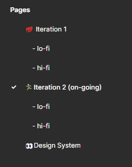
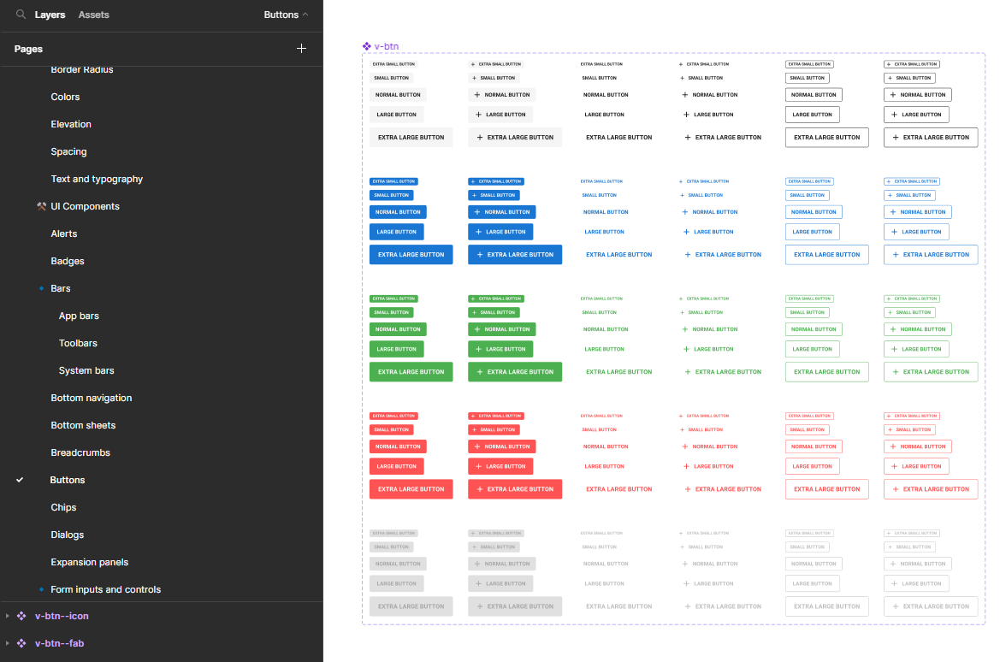
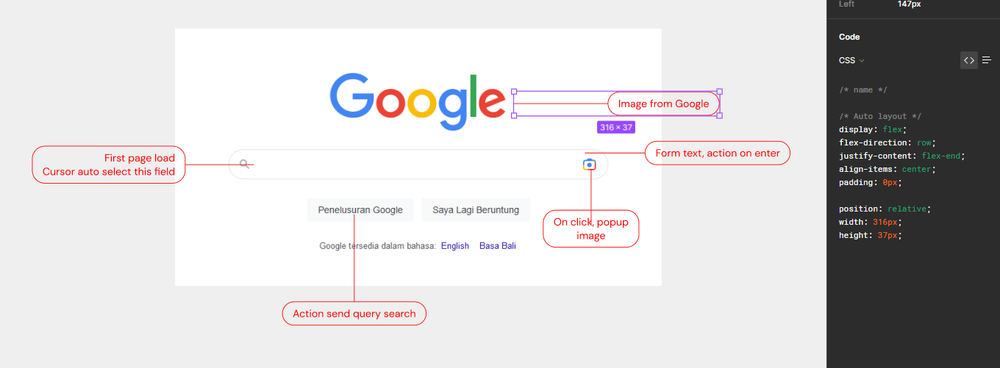
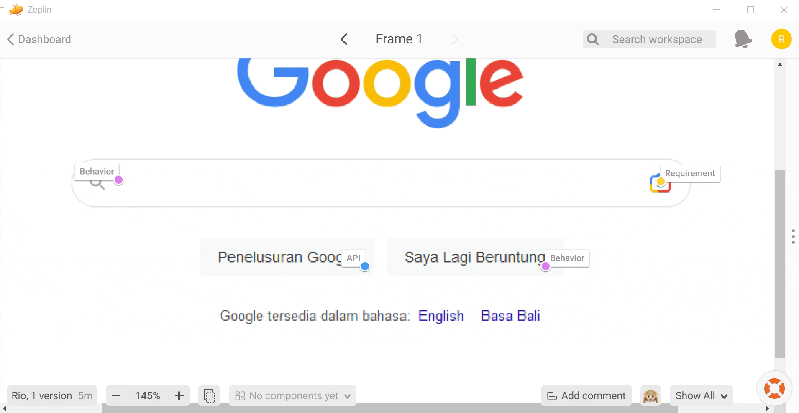
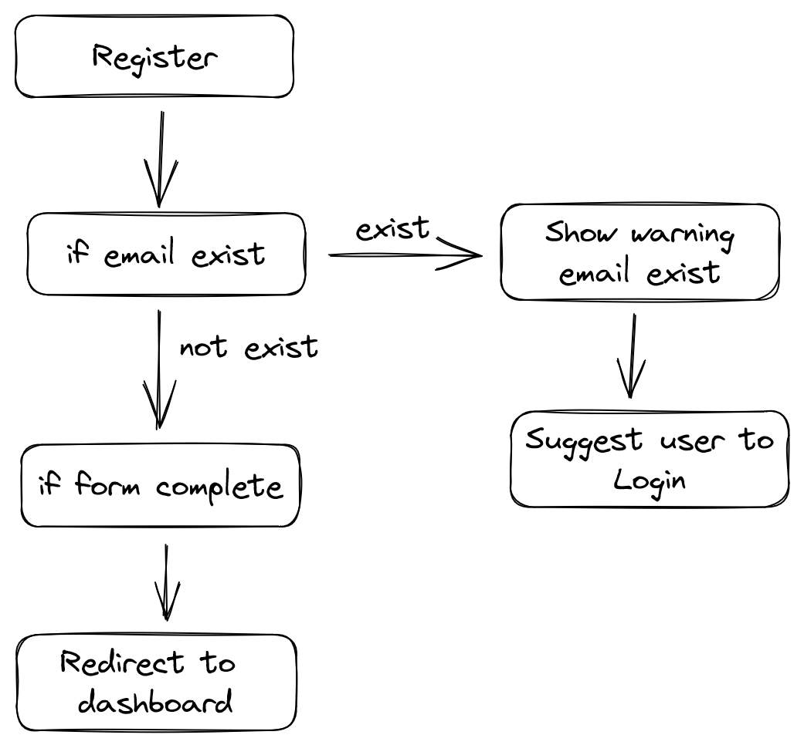
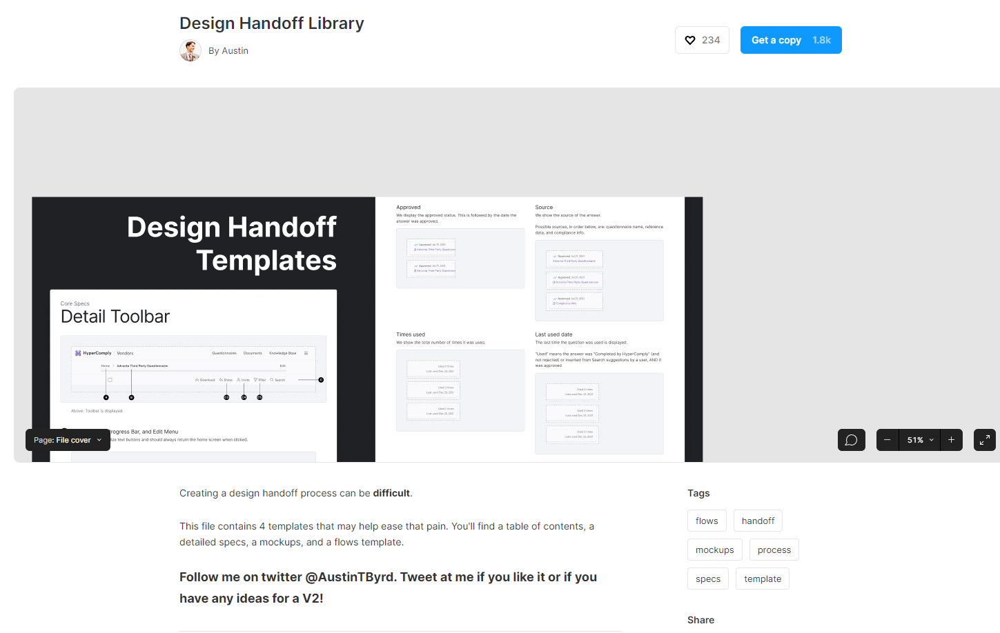
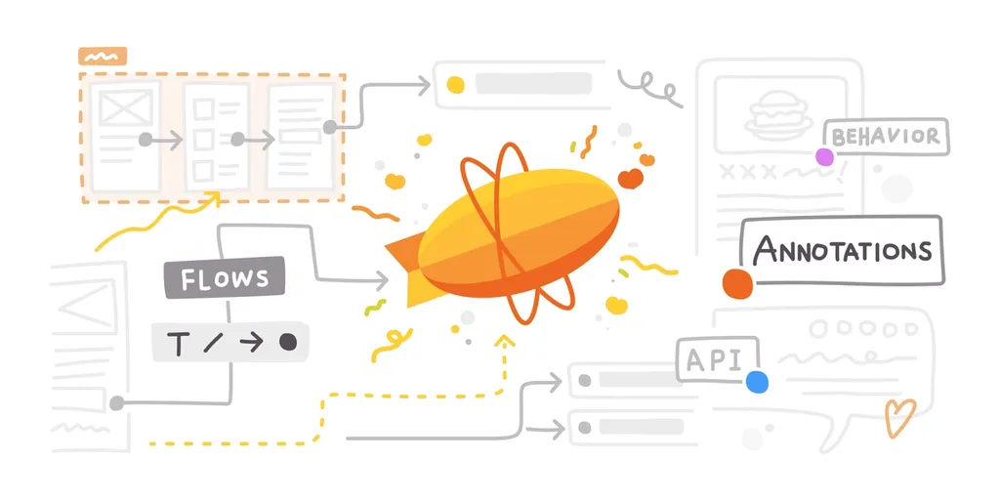

# Panduan Handoff Design ke Developer

Saat ini Desain aplikasi tidak pernah semudah ini dari pada sebelumnya. Sudah banyak aplikasi seperti [Figma](https://figma.com) atau [adobe xd](https://adobe.com) yang memiliki fitur *Realtime collaboration*, ini memudahkan developer yang tidak perlu menunggu desain selesai sepenuhnya dan bisa langsung kolaborasi secara *realtime*.

*Handoff* artinya **Serah Terima**, proses pengiriman desain ke developer untuk dieksekusi. Banyak kesalahan fatal dari Designer UI/UX saat mengirimkan desainnya kepada developer yaitu **hanya mengirimkan**. Bagi stakeholder atau project owner pasti mudah terima karena cukup melihat hasil akhir, tapi bagi developer yang cara berpikirnya "Jika ini maka ini." dan cukup detail. Tak jarang developer yang pertama kali melihat desain UI terkaget lalu berkata "APA ? Kalau begini gimana ?, Ini tombolnya kemana? ini aksinya gimana ?". Bertanya dan menjelaskan langsung pada saat itu sangat membuang waktu dan jangan percaya ingatan manusia yang mudah lupa.

Metode handoff ini harapannya bisa membantu desainer dan developer berkomunikasi dengan baik tanpa developer atau team lead bertanya-tanya banyak hal yang tidak perlu lagi.

Ini bukanlah metode standard industri, tapi inti dari pemabahasan ini adalah bagaimana management desain untuk dikirimkan kepada developer tanpa membuang waktu untuk menjelaskan satu-persatu. Semua yang ada disini hanya berdasarkan referensi saya pribadi dan beberapa riset mengenai metode handoff desain.

________________________________

## Management File

Mengingat desainer sangat berinteraksi dengan file dan folder, pastikan file memiliki format yang rapi dan terurut, tidak dicampur-adukkan semua desain. Pada umumnya desain UI terbagi beberapa yaitu **Low-fi**, **Wireframe**, dan **High-fi**.

```
Folder desain 
- wireframe
- lo-fi
- mockup
- hi-fi

* Bisa ditambah atau dikurangi berdasarkan kebutuhan
```

Saat ini, pengembangan aplikasi sudah menggunakan iterasi (atau sprint). File Desain perlu dipisahkan agar dapat track perubahan setiap iterasi. Lebih baik jika sub folder berisi jenis desain.

```
Folder desain
- iterasi 1
  - lo-fi
  - hi-fi
- iterasi 2
  - lo-fi
  - hi-fi
```

Management file ini sangat berguna selain untuk developer, juga berguna untuk desainer selanjutnya yang akan memegang projek yang sama. Jika bisa didokumentasikan dengan baik itu lebih bagus.

Pada figma, memang tidak menyediakan fitur **Sub folder** tapi bisa diakali menggunakan 4 spasi kosong didepan text agar terlihat seperti sub page.



## Design System

Sistem Desain (Design System) adalah seperangkat pola yang saling berhubungan dan praktik bersama yang diatur secara koheren [^wikipedia](https://en.wikipedia.org/wiki/Design_system#cite_note-1). Design system membuat pola dari aplikasi yang dibuat, bagaimana bentuk tombol ? bentuk form ? size ? space margin/padding ? warna ? error ? warning ? text ?. Design System menjawab semua ini. Ini sangat membantu developer dan membantu desainer untuk tetap konsisten pada setiap halaman.

Jika projek yang kamu kerjakan menggunakan library UI yang sudah menyediakan design system, lebih baik ikuti library UI tersebut. Berikut contoh design system dari [vuetify](https://vuetifyjs.com/en/)



## Dokumentasi dan anotasi



Dokumentasi desain perlu dibuat, desainer tidak perlu menjelaskan satu-persatu saat meeting, cukup beri gambaran besar dan sisanya akan dijelaskan dari dokumenasi. Step ini **Tidak boleh** dilewatkan saat ingin handoff kepada developer.

Saat ini aplikas desain UI sudah sangat membantu untuk dokumentasi teknis seperti size, space margin/padding, ukuran text, hingga kode warna sudah menjadi fitur utama aplikasi desain. Tapi dokumentasi flow dan aplikasi perlu dibuat manual, dokumentasi harus berupa : 

- *Flow*, dari page mana ke mana ?
- *Behaviour*, Bagaimana perilaku user terhadap desain ?
- *Requirement*, Apa saja spesifikasi desainnya ?
- *API*, API yang digunakan ?

Selain poin-poin diatas, dokumentasi Desain bisa melingkupi seperti kondisi *if else*. Semakin lengkap dokumentasi desain, semakin cepat pengerjaan developer, tidak perlu menghabiskan waktu untuk menjelaskan berulang-ulang.



## *Think Like Developer* (Be detail)

Developer selalu berpikir menggunakan logika. Berpikir logis, detail dan teratur adalah kebiasaan developer.

> *Semua orang bisa membuat desain, tapi desainger yang baik adalah Desain yang logis, detail dan teratur.*

Desain yang logis maksudnya adalah desain yang memiliki flow yang masuk akal dan sesuai dengan kebutuhan bisnis. Desain yang detail menjelaskan bagaimana behaviour user terhadap tampilan UI, bisa jadi ada beberapa cabang flow, flow yang detail dapat menggambarkan kondisi yang sebenarnya. Teratur adalah bagaimana menjelaskan melalui desain konsep gambaran kasar (lo-fi) ke gambaran detail (high-fi)



## Beri Opsi Desain

Developer terkadang memiliki pertimbangan apakah desain tersebut dapat dikerjakan dalam waktu singkat atau tidak. Beri kebebasan kepada developer untuk memilih yang mana paling possible dijalankan.

Memberikan opsi 1-2 halaman dengan fitur yang sama dapat memudahkan developer dan tim lainnya untuk memilih agar tidak perlu lagi revisi tampilan. *Manusia menyukai pilihan, karena dia merasa memiliki kuasa dan punya kontrol.*

________________________________

## Tools Referensi

### Figma

Figma punya fitur yang cukup lengkap. Membuat dokumentasi dan anotasi di figma bisa menggunakan anotasi template dari *figma community*. Salah satu contohnya [Design handoff library dari Austin](https://www.figma.com/community/file/1070916601120008196)



Kekurangan dari anotasi di figma akan menimpa desain page yang sudah ada, ini nampak seperti tidak aestetik dan kadang nampak lebih berantakan.


### Zeplin



Zeplin adalah pilihan yang bagus karena memiliki fitur membuat dokumentasi dan handoff yang cukup lengkap. Mulai dari dokumentasi, annotasi, komentar, hingga flow desain sudah disediakan dengan lengkap. Selengkapnya [Introducing Flows and Annotations — A new way to communicate design intention ](https://blog.zeplin.io/introducing-flows-and-annotations-a-new-way-to-communicate-design-intention)


Zeplin menawarkan fitur dokumentasi dan anotasi yang sangat baik, juga [zeplin bisa integrasi ke figma](https://zeplin.io/figma/) untuk memudahkan transfer desain dari figma ke zeplin dan membuat anotasi di zeplin. saya menyarankan tools ini untuk deliver desain kepada developer. Kira-kira flow handoff ketika menggunakan zeplin seperti ini

- Desain halaman di figma
- Kirim desain menggunakan [Figma plugin zeplin](https://zeplin.io/figma/)
- Membuat flow di zeplin
- Membuat anotasi dan dokumen di zeplin
- Kirim link zeplin kepada developer

________________________________

## Kesimpulan

Membuat dokumentasi dan anotasi sangat penting pada sebuah desain saat ingin deliver kepada developer. Semakin lengkap maka semakin banyak waktu yang dapat dimaksimalkan dan diefisienkan, meminimalkan pertanyaan *bagaimana, apa, dan kenapa* saat deliver ke developer. Ada beberapa tools untuk memudahkan pembuatan dokumentasi desain seperti zeplin. Inisiatif untuk kerjasama dengan baik demi menjaga keharmonisan tim dalam pengembangan produk.