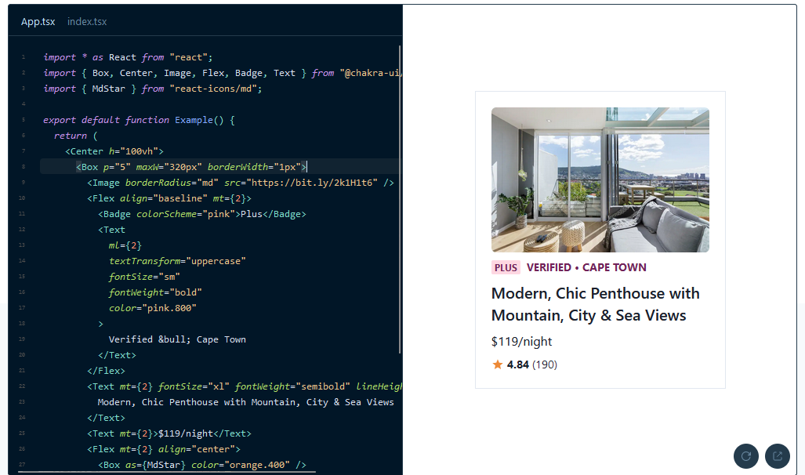
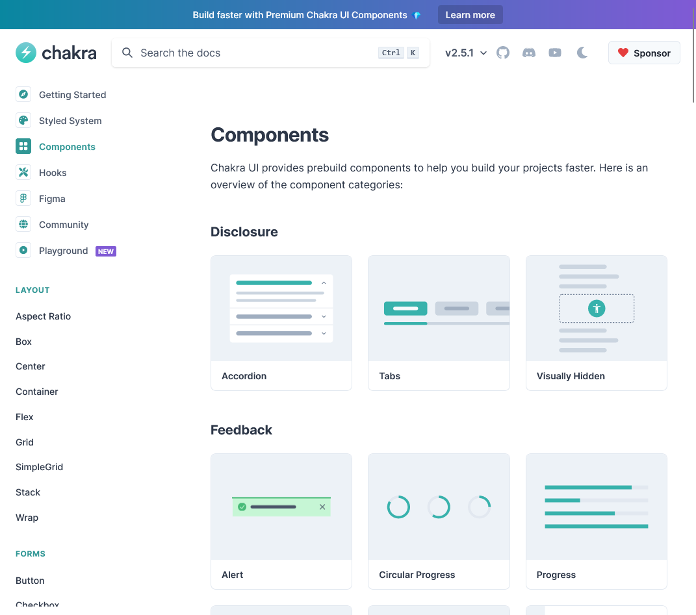
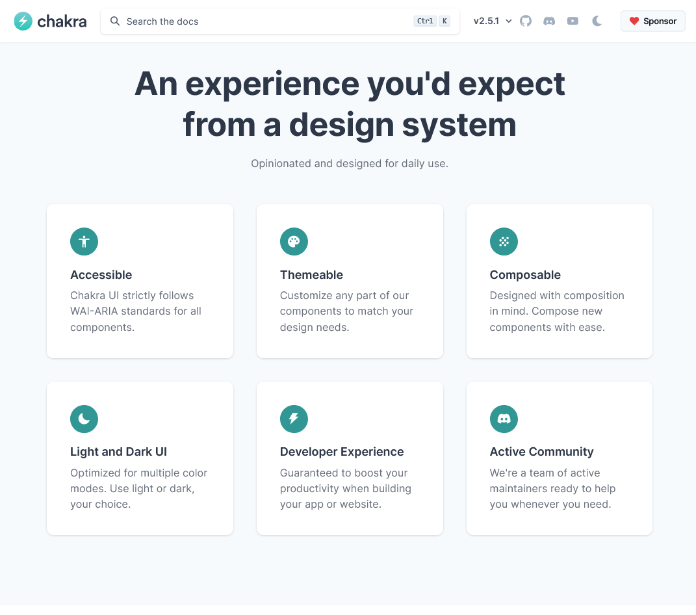

## Framework UI

Membuat projek Reactjs sangat memerlukan tampilan frontend yang menarik dan menawan, tanpa framework UI, semua komponen web perlu di desain dari awal menggunakan CSS dan itu akan memakan waktu. Selain waktu, desain yang tidak konsisten kadang mengganggu mata dan tidak jarang menjadi tidak nyaman. Saat ini ada banyak framework UI yang bisa digunakan secara gratis bahkan dengan lisensi MIT. Salah satu contohnya adalah [Chakra UI](https://chakra-ui.com/).

[Chakra UI](https://chakra-ui.com/) mirip seperti [Tailwindcss](https://tailwindcss.com/) tetapi versi react yang lebih menyatu dengan ekosistem react, selain itu memiliki banyak komponen built-in yang siap pakai. Ini bisa menjadi salah satu opsi framework UI untuk projek kamu 
selanjutnya.



Kenapa ini Cocok untuk projek kamu selanjutnya ?

## Pre-built komponen



Chakra ui memiliki belasan hingga [puluhan komponen yang siap pakai](https://chakra-ui.com/docs/components). Ini menjadi solusi bagi developer yang ingin membuat projek baru dengan cepat tanpa harus membuat semua desain komponen dari awal, berbeda dengan Tailwindcss yang harus membuat semua komponen dari awal yang akan cukup memakan waktu walaupun secara ukuran aplikasi lebih ringan, tapi jika ukuran aplikasi tidak masalah bagimu, ini menjadi pilihan yang bagus.

## Semua pengaturan CSS ada di `Props Komponen`

```jsx
<Box p="5" maxW="320px" borderWidth="1px">
  <Image borderRadius="md" src="https://bit.ly/2k1H1t6" />
</Box>
        
```

Bagaimana ku katakan, ini sangat cocok untuk lingkungan Reactjs. Semua komponen di Chakra UI sudah ada pengaturan css, seperti `sizing`, `border`, `color`, `background`, `position`, semuanya ada. Tag element seperti `<div />`, diganti dengan `Box`.

Bahkan tidak hanya itu, juga dia memiliki `colorScheme` atau disebut warna template untuk mengatur warna pada sebuah objek saat default, hover, active, dan event lainnya.

```jsx
<Wrap spacing={4}>
  <WrapItem>
    <Button colorScheme='gray'>Gray</Button>
  </WrapItem>
  <WrapItem>
    <Button colorScheme='red'>Red</Button>
  </WrapItem>
  <WrapItem>
    <Button colorScheme='orange'>Orange</Button>
  </WrapItem>
</Wrap>
```

Bagi kamu yang ingin desain yang fleksibel tapi tetap menjaga estetika desain web. Ini jadi pilihan yang cocok

## A11y (Accessibility)

A11y (accessbility) adalah proses membuat produk digital seperti web, aplikasi mobile dan alat daring lainnya, dapat diakses oleh semua orang termasuk orang yang berkebutuhan khusus. Ini akan mempermudah user untuk mengggunakan website kamu.

Ini sangat penting, A11y tidak hanya menargetkan pengguna cursor dan layar sentuh saja, melainkan pengguna keyboard juga karena aksessibilitas akan lebih mudah menggunakan keyboard dari pada menggunakan mouse untuk menggerakkan kursor dan pointer. Jika produk digital kamu tidak bisa dioperasikan menggunakan keyboard, maka produk mu tidak akan pernah dapat diakses oleh semua orang. **[If your digital property doesn’t work with the keyboard, it will NEVER be accessible no matter how accessible it is in other areas](https://sheribyrnehaber.medium.com/ten-basic-accessibility-facts-abcaf0acfe3e)**

> *Chakra UI strictly follows WAI-ARIA standards for all components.*

Chakra UI mengikuti *standard WAI-ARIA* sehingga semua komponen Chakra UI memenuhi kebutuhan aksesibilitas. Kamu tidak perlu khawatir tentang komponen Chakra UI sehingga bisa fokus dalam pembuatan desain web yang bagus.

## Dan fitur lainnya



Chakra UI memiliki feature lainnya seperti *Dark mode*, *theme* hingga Komunitas yang aktif yang menjadi alasan yang bagus kenapa ini menjadi opsi framework UI reactjs kamu selanjutnya. Projek *open source* seperti ini dapat meningkatkan produktifitas programmer dan mengembangkan banyak kemungkinan yang bisa dibayangkan. Jangan lupa untuk memberikan kontribusi hingga support kepada pembuat dan komunitas yang membangun ini semua. Semoga bermanfaat. Sekian terima kasih