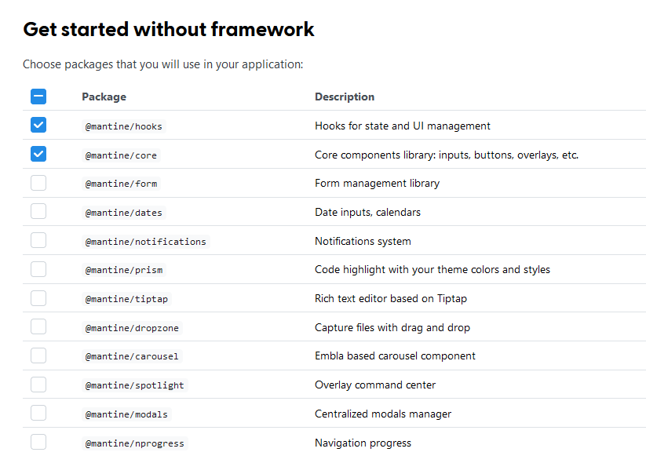
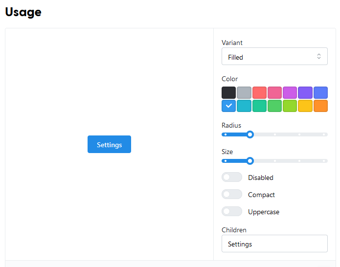
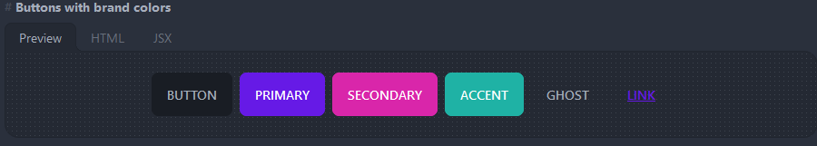
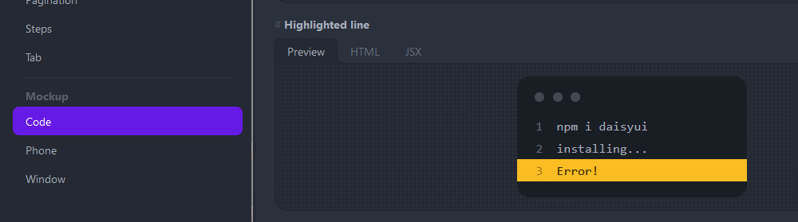
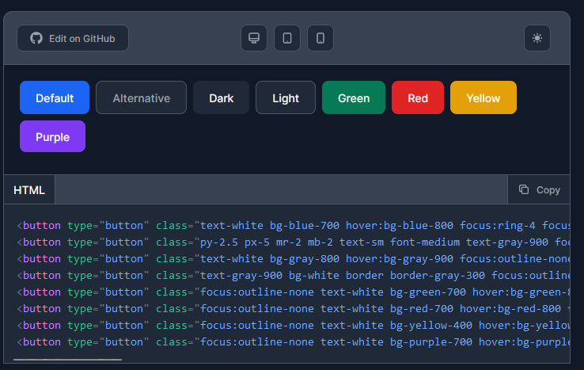
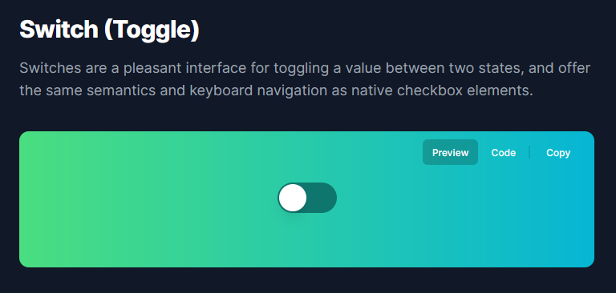
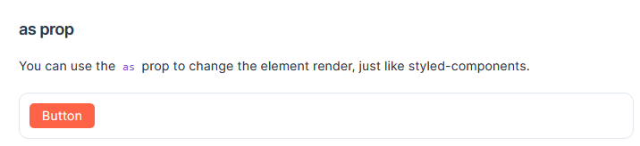
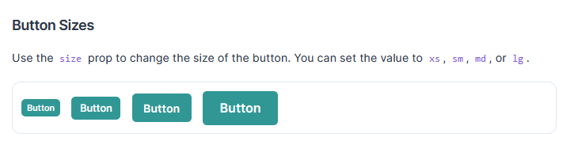

Selamat datang di blog saya! Pada kesempatan kali ini, saya akan membahas tentang review framework website UI. Sebagai seorang web developer, saya sering menggunakan framework website UI untuk mempercepat proses pembuatan website dan meningkatkan kualitas tampilannya.

Namun, tidak semua framework website UI cocok untuk semua kebutuhan. Oleh karena itu, dalam artikel ini saya akan membahas beberapa framework website UI yang populer dan memberikan ulasan tentang kelebihan dan kekurangannya.

Tentunya, sebagai pembaca, Anda mungkin bertanya-tanya apa manfaat membaca blog seperti ini. Nah, ada beberapa manfaat yang bisa Anda dapatkan dari membaca blog tentang review framework website UI, antara lain:

1. Menambah pengetahuan tentang framework website UI yang sedang populer dan efektif
2. Memperoleh informasi tentang kelebihan dan kekurangan dari setiap framework website UI.
3. Memperluas wawasan tentang perkembangan teknologi web.
4. Dapat membandingkan beberapa framework website UI sehingga Anda dapat memilih yang terbaik sesuai kebutuhan Anda.

Beberapa framework UI yang saya review bisa periksa pada *Table of Contents*, kamu bisa pilih framework mana yang ingin kamu baca dan bandingkan.

## Mantine

Kategori : Library UI

Website : [https://mantine.dev/](https://mantine.dev/)

Github stars : 18k

NPM Weekly Downloads: 148.983

### License

MIT License

### Prebuilt component

Mantine membagi komponenen-komponennya menjadi beberapa package yang berbeda-beda, sehingga kamu bisa memilih package yang cocok untuk kamu.

Berikut contoh komponen yang dimiliki oleh mantine : Layout, button, input, navigation, data display, overlay, typography, feedback, miscellaneous, date input, dropzone, carousel, modal, rich text editor, spotlight, notification



Mantine memiliki banyak komponen prebuilt mulai dari komponen krusial seperti input, button, layout, data display dan typography hingga komponen tambahans eperti dropzone, carausel, dan rich text editor yang beberapa kasus diperlukan. Tidak perlu pasang berbeda-beda library untuk kebutuhan custom. Mantine sudah memiliki hampir semua komponen kebutuhan website.

```jsx
import { Button } from '@mantine/core';

function Demo() {
  return (
    <Button>
      Settings
    </Button>
  );
}
```



### Customization

Mantine memiliki *Theming* dan disimpan didalam [*Theme Object*](https://mantine.dev/theming/theme-object/). *Theme Object* dapat mengatur seperti warna, font, spacing, border-radius dan token desain lainnya.

```ts
interface MantineTheme {
  colorScheme: 'light' | 'dark';
  focusRing: 'auto' | 'always' | 'never';
  focusRingStyles: {
    styles(theme: MantineThemeBase): CSSObject;
    resetStyles(theme: MantineThemeBase): CSSObject;
    inputStyles(theme: MantineThemeBase): CSSObject;
  };
  respectReducedMotion: boolean;
  defaultRadius: 'xs' | 'sm' | 'md' | 'lg' | 'xl' | string | number;
  white: string;
  black: string;

  colors: Record<string, Tuple<string, 10>>;
  primaryColor: string;
  ...
}
```

### Community Support

Selain komunikasi dari github, mantine juga memiliki akses ke [Discord](https://mantine.dev/)

### Learning Curve

Karena cukup banyak komponen prebuilt yang dimiliki oleh mantine, kamu perlu pelajari apa saja yang bisa dilakukan setiap komponen dan sampai mana kapabilitas dari komponen tersebut. Ini cukup memakan waktu jika kamu pertama kali ke mantine, tapi cukup layak (*Worth it*) ketika kamu sudah paham dan lanjut ke projek baru dan bisa disupport dengan 1 library UI saja.

### Documentation

Dokumentasi dapat diakses di website tersedia cukup lengkap, tidak ada halaman yang *Not found* atau *sedang pengerjaan*. Dokumentasi mulai dari instalasi, penggunanaan komponen, hingga changelog sudah tersedia.

### Is Support ...?

- Is support Server-side Rendering (SSR) ? : Yes
- Is support Typescript ? : yes
- Is support Dark Mode ? : yes
- Is support Right-to-Left (RTL) ? : yes

--------------------------------------------------------------------------------------

## daisyUI

Kategori : Library UI

Website : [https://daisyui.com/](https://daisyui.com/)

Github stars : 18.7k

NPM Weekly Downloads: 178.911

### License

MIT License

### Prebuilt component

daisyUI memiliki prebuilt komponen seperti button, dropdown, modal, data display, alert, data input, layout, navigation, carousel, chat bubble. Daisy memiliki komponen esensial untuk membangun website.

DaisyUI berbasis *Component class* maka ini cocok di semua projek baik itu projek tanpa framework Frontend ataupun menggunakan Framework frontend. Berikut contoh kode daisy UI membuat Button

```html
<button class="btn">Button</button>
<button class="btn btn-primary">Button</button>
<button class="btn btn-secondary">Button</button>
<button class="btn btn-accent">Button</button>
<button class="btn btn-ghost">Button</button>
<button class="btn btn-link">Button</button>
```



Keunikan daisy adalah memiliki template membuat `Mockup` dengan 3 tipe yaitu *code*, *phone* dan *window*. Detail lengkap ada di dokumentasi [daisyUI Mockup](https://daisyui.com/components/mockup-code/)

```html
<div class="mockup-code">
  <pre data-prefix="1"><code>npm i daisyui</code></pre> 
  <pre data-prefix="2"><code>installing...</code></pre> 
  <pre data-prefix="3" class="bg-warning text-warning-content"><code>Error!</code></pre>
</div>
```



### Customization

DaisyUI menggunakan base function [Tailwind](https://tailwindcss.com), maka untuk customisasi bisa ditambahkan didalam file `tailwind.config.js`. karena pada dasarnya menggunakan *Component Class* maka dapat [menggunakan *tailwind @apply directive*.](https://daisyui.com/docs/customize/)

```css
.btn {
  @apply rounded-full;
}
```

### Community Support

Daisy UI hanya menggunakan github sebagai alat komunikasi antar developer.

### Learning Curve

DaisyUI cukup simple, tidak banyak komponen built-in dan penggunaan juga straight-to-the-point. Framework UI yang berbasis Component Class dan karena backend dari daisyUI adalah tailwindcss maka akan mudah digunakan bagi tailwindcss. Tapi jika kamu belum pernah menggunakan tailwindcss tidak masalah karena cukup plug and play ikuti dokumentasi.

### Documentation

Dokumentasi dapat diakses di website tersedia cukup lengkap, tidak ada halaman yang *Not found* atau *sedang pengerjaan*. Dokumentasi mulai dari instalasi, penggunanaan komponen, hingga changelog sudah tersedia.

### Is Support ...?

- Is support Server-side Rendering (SSR) ? : No
- Is support Typescript ? : No
- Is support Dark Mode ? : yes
- Is support Right-to-Left (RTL) ? : No

--------------------------------------------------------------------------------------

## Flowbite

Kategori : Library UI

Website : [https://flowbite.com/](https://flowbite.com/)

Github stars : [4k](https://github.com/themesberg/flowbite)

NPM Weekly Downloads: [93,896](https://www.npmjs.com/package/flowbite)

### License

MIT License

### Prebuilt component

Flowbite tidak menyediakan komponen prebuilt seperti library UI lainnya, tapi flowbite memiliki pendekatan lain yaitu menggunakan tailwindcss sebagai pondasi style dan menyiapkan style class komponen untuk setiap aset website seperti button, typograph, card, dan lain-lain. Jadi, flowbite bisa jalan pada projek yang sudah memiliki tailwindcss sebelumnya. Sebagai contoh berikut cara membuat button.


```html
<button type="button" class="text-white bg-blue-700 hover:bg-blue-800 focus:ring-4 focus:ring-blue-300 font-medium rounded-lg text-sm px-5 py-2.5 mr-2 mb-2 dark:bg-blue-600 dark:hover:bg-blue-700 focus:outline-none dark:focus:ring-blue-800">Default</button>
<button type="button" class="py-2.5 px-5 mr-2 mb-2 text-sm font-medium text-gray-900 focus:outline-none bg-white rounded-lg border border-gray-200 hover:bg-gray-100 hover:text-blue-700 focus:z-10 focus:ring-4 focus:ring-gray-200 dark:focus:ring-gray-700 dark:bg-gray-800 dark:text-gray-400 dark:border-gray-600 dark:hover:text-white dark:hover:bg-gray-700">Alternative</button>
<button type="button" class="text-white bg-gray-800 hover:bg-gray-900 focus:outline-none focus:ring-4 focus:ring-gray-300 font-medium rounded-lg text-sm px-5 py-2.5 mr-2 mb-2 dark:bg-gray-800 dark:hover:bg-gray-700 dark:focus:ring-gray-700 dark:border-gray-700">Dark</button>
<button type="button" class="text-gray-900 bg-white border border-gray-300 focus:outline-none hover:bg-gray-100 focus:ring-4 focus:ring-gray-200 font-medium rounded-lg text-sm px-5 py-2.5 mr-2 mb-2 dark:bg-gray-800 dark:text-white dark:border-gray-600 dark:hover:bg-gray-700 dark:hover:border-gray-600 dark:focus:ring-gray-700">Light</button>
<button type="button" class="focus:outline-none text-white bg-green-700 hover:bg-green-800 focus:ring-4 focus:ring-green-300 font-medium rounded-lg text-sm px-5 py-2.5 mr-2 mb-2 dark:bg-green-600 dark:hover:bg-green-700 dark:focus:ring-green-800">Green</button>
<button type="button" class="focus:outline-none text-white bg-red-700 hover:bg-red-800 focus:ring-4 focus:ring-red-300 font-medium rounded-lg text-sm px-5 py-2.5 mr-2 mb-2 dark:bg-red-600 dark:hover:bg-red-700 dark:focus:ring-red-900">Red</button>
<button type="button" class="focus:outline-none text-white bg-yellow-400 hover:bg-yellow-500 focus:ring-4 focus:ring-yellow-300 font-medium rounded-lg text-sm px-5 py-2.5 mr-2 mb-2 dark:focus:ring-yellow-900">Yellow</button>
<button type="button" class="focus:outline-none text-white bg-purple-700 hover:bg-purple-800 focus:ring-4 focus:ring-purple-300 font-medium rounded-lg text-sm px-5 py-2.5 mb-2 dark:bg-purple-600 dark:hover:bg-purple-700 dark:focus:ring-purple-900">Purple</button>
```



Flowbite memiliki banyak komponen tailwind prebuilt seperti (Saya ekstrak dari [Component list](https://flowbite.com/#components)) : Alerts, Accordion, Avatar, Badges, Breadcrumbs, Buttons, Button group, Cards, Carousel, Dropdown, Forms, List group, Typography, Modal, Tabs, Navbar, Footer, Sidebar, Pagination, Speed Dial, Rating, Timeline, Progress bar, Table, Spinner, Toast, Tooltips, Datepicker, Input Field, File Input, Search Input, Select, Textarea, Checkbox, Radio, Toggle, Range Slider, Floating Label, Mega menu, Skeleton, KBD (Keyboard), Drawer (offcanvas), Popover, Video, Heading, Paragraph, Blockquote, Image, List, Link, Text, Horizontal line (HR), Stepper, Indicators, Bottom Bar

Bisa dikatakan ini adalah "Komponen tailwind" karena ia hanya menyediakan class tailwindcss untuk setiap komponen. Ini akan sangat membantu developer tailwindcss untuk setup komponen esensial pada projeknya.

### Customization

Tidak ada kostumisasi khusus, kamu bisa menggunakan [tailwind css configuration](https://tailwindcss.com/docs/configuration).

### Community Support

Flowbite selain memiliki [github](https://github.com/themesberg/flowbite) juga memiliki [discord](https://discord.gg/4eeurUVvTy) dan [channel youtube](https://www.youtube.com/channel/UC_Ms4V2kYDsh7F_CSsHyQ6A) berisi crash course tutorial.

### Learning Curve

Untuk mempelajari ini kamu perlu paham tailwindcss terlebih dahulu, tapi jika kamu sudah memahami tailwindcss maka ini menjadi *starter point* yang cocok dan tidak perlu mempelajari banyak hal, cukup ambil komponen yang dibutuhkan saja.

### Documentation

Dokumentasi dapat diakses di website tersedia cukup lengkap, tidak ada halaman yang *Not found* atau *sedang pengerjaan*. Dokumentasi mulai dari instalasi, penggunanaan komponen, hingga changelog sudah tersedia.

### Is Support ...?

> Pada dasarnya flowbite menggunakan tailwind, maka ketersediaan fitur ini tergantung tailwindcss

- Is support Server-side Rendering (SSR) ? : No
- Is support Typescript ? : yes
- Is support Dark Mode ? : yes
- Is support Right-to-Left (RTL) ? : Yes

--------------------------------------------------------------------------------------

## HeadlessUI

Kategori : Library UI

Website : [https://headlessui.com/](https://headlessui.com/)

Github stars : 19.3k

NPM Weekly Downloads: [1,014,777](https://www.npmjs.com/package/@headlessui/react)

### License

MIT License

### Prebuilt component

Headless UI merupakan projek dari Tailwindcss yang mana tidak berbasis styling komponen tidak dari *component  class* melainkan komponen framework frontend seperti reactjs dan vuejs. Berikut contoh membuat [*switch* di headlessUI react](https://headlessui.com/react/switch)

```jsx
import { useState } from 'react'
import { Switch } from '@headlessui/react'

function MyToggle() {
  const [enabled, setEnabled] = useState(false)

  return (
    <Switch
      checked={enabled}
      onChange={setEnabled}
      className={`${
        enabled ? 'bg-blue-600' : 'bg-gray-200'
      } relative inline-flex h-6 w-11 items-center rounded-full`}
    >
      <span className="sr-only">Enable notifications</span>
      <span
        className={`${
          enabled ? 'translate-x-6' : 'translate-x-1'
        } inline-block h-4 w-4 transform rounded-full bg-white transition`}
      />
    </Switch>
  )
}
```



Berikut contoh komponen yang tersedia : Menu (Dropdown), Listbox (Select), Combobox (Autocomplete), Switch (Toggle), Disclosure, Dialog (Modal), Popover, Radio Group, Tabs, Transition.

### Customization

Tidak ada kostumisasi khusus, kamu bisa menggunakan [tailwind css configuration](https://tailwindcss.com/docs/configuration).

### Community Support

Headless UI hanya memiliki [Github](https://github.com/tailwindlabs/headlessui)

### Learning Curve

Untuk mempelajari ini kamu perlu paham tailwindcss terlebih dahulu, tapi jika kamu sudah memahami tailwindcss maka ini menjadi *starter point* yang cocok dan tidak perlu mempelajari banyak hal, cukup ambil komponen yang dibutuhkan saja.

### Documentation

Dokumentasi dapat diakses di website tersedia cukup lengkap, tidak ada halaman yang *Not found* atau *sedang pengerjaan*. Dokumentasi mulai dari instalasi, penggunanaan komponen, hingga changelog sudah tersedia.

### Is Support ...?

- Is support Server-side Rendering (SSR) ? : No
- Is support Typescript ? : yes
- Is support Dark Mode ? : yes
- Is support Right-to-Left (RTL) ? : Yes


## Chakra UI

Kategori : Library UI

Website : [https://chakra-ui.com/](https://chakra-ui.com/)

Github stars : [31.5k](https://github.com/chakra-ui/chakra-ui/)

NPM Weekly Downloads: [468,807](https://www.npmjs.com/package/@chakra-ui/react)

### License

MIT License

### Prebuilt component

Chakra UI hanya tersedia untuk framework reactjs. Chakra ui memiliki konsepp mirip tailwindcss dalam implementasi styling tapi berbeda karena implementasi styling langsung dilakukan pada *Props Componen React*. Contoh menggunakan komponen Box untuk membuat button hanya menggunakan styling

```jsx
<Box as='button' borderRadius='md' bg='tomato' color='white' px={4} h={8}>
  Button
</Box>
```



Chakra UI memiliki banyak komponen built-in antara lain : accordion, alert, anatomy, avatar, breadcrumb, button, card, checkbox, clickable, close-button, color-mode, control-box, counter, css-reset, descendant, editable, env, focus-lock, form-control, icon, icons, image, input, layout, live-region, media-query, menu, modal, number-input, pin-input, popover, popper, portal, progress, provider, radio, react, select, skeleton, skip-nav, slider, spinner, stat, switch, table, tabs, tag, textarea, theme-tools, theme, toast, tooltip, transition, visually-hidden

```jsx
<Stack spacing={4} direction='row' align='center'>
  <Button colorScheme='teal' size='xs'>
    Button
  </Button>
  <Button colorScheme='teal' size='sm'>
    Button
  </Button>
  <Button colorScheme='teal' size='md'>
    Button
  </Button>
  <Button colorScheme='teal' size='lg'>
    Button
  </Button>
</Stack>
```



### Customization

Chakra UI mendukung perubahan custom seperti tertulis dokumentasi [Customize Theme Chakra UI](https://chakra-ui.com/docs/styled-system/customize-theme).

### Community Support

Chakra UI memiliki [Github](https://github.com/chakra-ui/chakra-ui), [Discord](https://chakra-ui.com/discord) dan [youtube](https://www.youtube.com/channel/UC4TmDovH46TB4S0SM0Y4CIg)

### Learning Curve

Jika kamu sudah memahami reactjs dan projek yang kamu gunakan reactjs, maka tidak sulit untuk menggunakan Chakra UI, komponen esensial sudah tersedia dan bisa di *custom* sesuai keinginan.

### Documentation

Dokumentasi dapat diakses di website tersedia cukup lengkap, tidak ada halaman yang *Not found* atau *sedang pengerjaan*. Dokumentasi mulai dari instalasi, penggunanaan komponen, hingga changelog sudah tersedia.

### Is Support ...?

- Is support Server-side Rendering (SSR) ? : yes
- Is support Typescript ? : yes
- Is support Dark Mode ? : yes
- Is support Right-to-Left (RTL) ? : yes


## Tailwindcss

Kategori : Utility Class

Website : [tailwindcss.com](https://tailwindcss.com)

Github stars : [65.7k](https://github.com/tailwindlabs/tailwindcss)

NPM Weekly Downloads: [5,526,949](https://www.npmjs.com/package/tailwindcss)

### License

MIT License

### Prebuilt component

Tailwindcss tidak memiliki prebuilt komponen, melainkan disediakan oleh framework UI lainnya seperti [tailwind UI](https://tailwindui.com), flowbite, headless UI dan daisy UI

### Customization

kostumisasi tema sangat disupport oleh tailwindcss

### Community Support

Tailwindcss hanya memiliki [github](https://github.com/tailwindlabs/tailwindcss)

### Learning Curve

Jika kamu berasal dari programmer website yang mendesain website menggunakan css styling, maka kamu perlu mempelajari konsep [*Utility-first fundamentals*](https://tailwindcss.com/docs/utility-first). Setelah memahami pondasi dasar ini, maka kamu tidak perlu membaca semua dokumentasi cukup cari apa yang kamu inginkan seperti *sizing*, *colors*, atau *shadow* lalu ambil *class component* yang tersedia.

### Documentation

Dokumentasi dapat diakses di website tersedia cukup lengkap, tidak ada halaman yang *Not found* atau *sedang pengerjaan*. Dokumentasi mulai dari instalasi, penggunanaan komponen, hingga changelog sudah tersedia.

### Is Support ...?

- Is support Server-side Rendering (SSR) ? : no
- Is support Typescript ? : no
- Is support Dark Mode ? : yes
- Is support Right-to-Left (RTL) ? : yes

# Penutup

Itulah artikel saya mengenai review framework website UI. Semoga artikel ini dapat memberikan manfaat dan membantu Anda dalam memilih framework website UI yang terbaik untuk kebutuhan Anda. Terima kasih sudah membaca, dan jangan lupa untuk tetap mengunjungi blog saya untuk informasi terbaru seputar teknologi web dan topik lainnya. Sampai jumpa di artikel berikutnya!