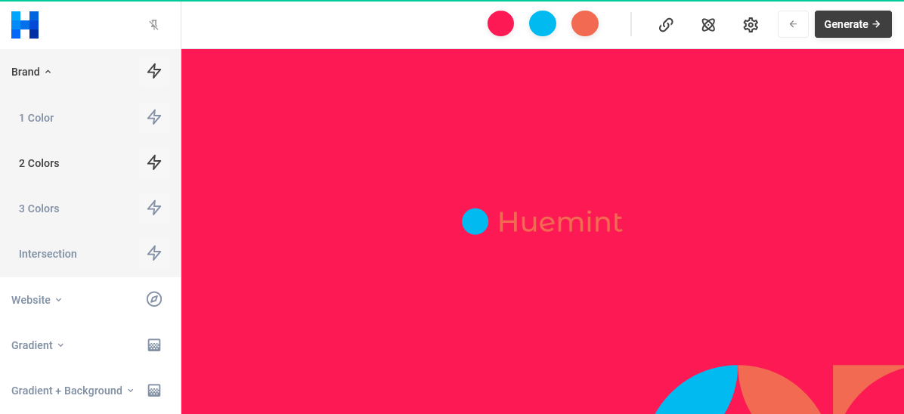

## New Design

I create new design for my image portfolio and CV. I use some tools to create it, like [Canva](https://www.canva.com/). It's free and easy to use. Before use canva I used [Figma](https://www.figma.com/) to create the design, but figma is vector base design not very much to manipulate image can do at there. So I use canva to create it.

## Color Palette

I use [Huemint](https://huemint.com/) to generate color palette for me. There are have plenty option to generate color palette, but I like this one. It's simple and easy to use.

## Background Generator

I use [Haikei App](https://app.haikei.app/) to generate image background, it's free and easy to use.

## Tools

Canva have a lot resource image free, I use these images a lot.I use [Remove.bg](https://www.remove.bg/) to remove background image. [Powertoys](https://learn.microsoft.com/en-us/windows/powertoys/) have a lot of tools to help you, I use [PowerRename](https://learn.microsoft.com/en-us/windows/powertoys/powerrename) to rename image file and [Image resize](https://learn.microsoft.com/en-us/windows/powertoys/image-resizer) to resize image.